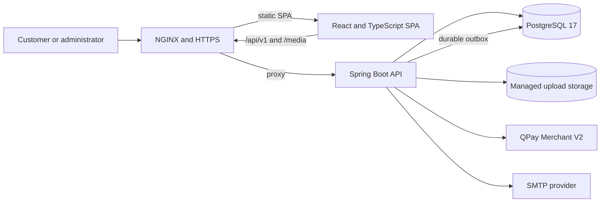
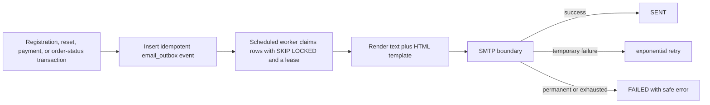

# HiLiving presentation guide

This document is a code-backed walkthrough of the current repository. It distinguishes implemented behavior from environment-dependent production readiness.

## 1. Concise architecture overview

HiLiving is a modular monorepo with two independently buildable applications:

- `frontend/`: a React 18 and TypeScript single-page application built by Vite. It contains the public storefront, customer account and checkout flows, and a role-protected administration UI.
- `backend/`: a Java 21 and Spring Boot 4 API. It owns authentication, authorization, validation, catalog and content rules, pricing, stock, orders, QPay reconciliation, media processing, audit records, and transactional email.

PostgreSQL is the durable source of truth. Flyway owns the schema from V1 through V18, while Hibernate validates rather than creates the schema. Managed image bytes live outside the database; PostgreSQL stores their metadata and URLs. The browser and production NGINX use same-origin `/api` and `/media` paths.



The central architectural rule is: the frontend proposes actions, while the backend establishes business truth.

For an advanced-web discussion of trust boundaries, authentication versus authorization, RBAC/ABAC, security controls, performance, bundle budgets, and scaling limits, use [`human/ADVANCED_WEB_APPLICATION.md`](human/ADVANCED_WEB_APPLICATION.md).

## 2. Request and data flows

### Public catalog

```text
Route/search/filter
  -> typed frontend API adapter
  -> GET /api/v1/products
  -> ProductController
  -> ProductService/ProductRepository
  -> active catalog rows in PostgreSQL
  -> { data: ... } response envelope
  -> DTO-to-view-model mapping
  -> loading, empty, error, or product UI
```

Catalog prices shown by the browser are informative. Checkout never trusts them.

### Authentication and CSRF

```text
Application starts
  -> GET /api/v1/account/me
  -> loading | anonymous | authenticated frontend state

Mutating request
  -> GET /api/v1/auth/csrf when the readable XSRF cookie is absent
  -> send HttpOnly JSESSIONID cookie
  -> mirror XSRF-TOKEN into X-XSRF-TOKEN
  -> Spring Security authorizes the session and role
  -> service transaction performs the mutation
```

Login accepts email or Mongolian phone number, applies pre-credential rate limits, verifies the encoded password, rotates the session ID, and stores the security context server-side. Password or login-email changes increment the user's session version so prior sessions are rejected.

### Checkout and QPay

```mermaid
sequenceDiagram
    participant UI as React checkout
    participant API as Spring Boot
    participant DB as PostgreSQL
    participant Q as QPay

    UI->>API: POST /cart/quote with slugs and quantities
    API->>DB: Reload products and customer discount
    API-->>UI: Authoritative MNT totals and stock limits
    UI->>API: POST /orders with CSRF and Idempotency-Key
    API->>DB: Lock products, re-price, deduct stock, snapshot order
    API->>Q: Create invoice with unguessable callback URL
    Q-->>API: Invoice, QR, and bank deeplinks
    API-->>UI: Order plus payment instructions
    Q->>API: Callback notification
    API->>Q: Check provider payment
    API->>DB: Verify invoice, exact amount, and MNT; mark PAID
    API->>DB: Enqueue one order-confirmation email
```

If invoice creation fails or the application-owned deadline expires, the backend locks the affected products and restores stock exactly once. A late or mismatched payment enters `RECONCILIATION_REQUIRED`; the browser cannot force `PAID`.

### Media

```text
ADMIN selects JPEG/PNG
  -> multipart upload with session and CSRF
  -> declared type, decoded type, extension, byte, dimension, and pixel checks
  -> decode and re-encode to a bounded image
  -> generated UUID storage key under a purpose directory
  -> metadata plus admin audit row in PostgreSQL
  -> immutable public /media/{purpose}/{uuid}.{ext} URL
```

Product, brand, banner, news, and page purposes have separate limits. File bytes are external to the release and database; metadata is relational.

### Email and outbox



Verification and reset tokens are single-use and hashed for validation. The copy needed for a future email is encrypted in the outbox payload. Email delivery is off by default and requires a stable `EMAIL_TOKEN_PROTECTION_KEY` whenever queued token emails must survive restarts.

### CI/CD and production

```text
pull request -> frontend checks + Java 21 backend verify

push to main -> same checks pass
             -> rebuild both artifacts for the exact commit
             -> create checksums
             -> pinned-SSH transfer with restricted deploy account
             -> switch backend release link
             -> systemd restart and localhost health check
             -> switch frontend release link
             -> NGINX check and public smoke checks
             -> restore previous code links if activation fails
```

The VPS topology keeps NGINX public, while Spring Boot and PostgreSQL listen only on loopback. PostgreSQL data, uploaded media, TLS material, backups, and secrets are outside commit-addressed release directories.

## 3. Project structure explanation

### Frontend

| Area                    | Purpose                                                                                 |
| ----------------------- | --------------------------------------------------------------------------------------- |
| `src/api/http.ts`       | Shared credentials, CSRF, response-envelope parsing, safe errors, and upload progress   |
| `src/api/*Api.ts`       | Domain endpoint adapters for account, catalog, content, commerce, and admin             |
| `src/features/auth`     | Session hydration, auth context, forms, and role-aware route guards                     |
| `src/features/cart`     | Versioned local cart plus backend quote reconciliation                                  |
| `src/features/catalog`  | Catalog view models and reusable request hooks                                          |
| `src/features/checkout` | Delivery, order, payment types, and status presentation                                 |
| `src/features/account`  | Profile, password, membership, address, and map behavior                                |
| `src/features/admin`    | Admin shell and product, taxonomy, user, order, banner, news, page, and media workflows |
| `src/components`        | Reusable storefront presentation grouped by page concern                                |
| `src/pages`             | Route-level composition and orchestration                                               |

`main.tsx` installs the router, authentication provider, and cart provider. `App.tsx` owns lazy route composition. Only API modules should call `fetch` or `XMLHttpRequest`.

### Backend

| Area                     | Purpose                                                                      |
| ------------------------ | ---------------------------------------------------------------------------- |
| `com.hiliving.api`       | Shared success/error envelopes and exception mapping                         |
| `com.hiliving.catalog`   | Category, brand, and product APIs, rules, and persistence                    |
| `com.hiliving.identity`  | Users, memberships, addresses, sessions, recovery, and admin user operations |
| `com.hiliving.commerce`  | Pricing, cart quotes, order transactions, inventory, and QPay                |
| `com.hiliving.content`   | Banners, news, fixed company pages, and shared HTML sanitization             |
| `com.hiliving.media`     | Image validation, re-encoding, storage boundary, and `/media` serving        |
| `com.hiliving.email`     | Templates, token protection, SMTP boundary, and durable outbox worker        |
| `com.hiliving.admin`     | Cross-domain dashboard reads and audit logging                               |
| `resources/db/migration` | Append-only schema and data evolution                                        |

The clearest catalog/identity packages use `api`, `application`, and `persistence` subpackages. Commerce, content, media, and email are more feature-flat; this is understandable at the current size but should be standardized only as those areas grow.

## 4. Architecture review and presentation risks

### Cleaned in this pass

- Extracted the credential-aware HTTP/CSRF/upload implementation from misleading `accountApi.ts` into `api/http.ts`, and renamed the cross-domain error from `AccountApiError` to `ApiRequestError`.
- Moved the homepage news card out of the unrelated `ScrollToTop.tsx`, removed its separated prop-only file, and gave it an explicit `HomepageNewsCard` name.
- Moved shared banner, news, and fixed-page models out of the admin feature so public pages no longer depend on admin-owned types.
- Split combined `BannerControllers.java` and `NewsControllers.java` files into one clearly named controller per file.
- Expanded the compressed dashboard controller/response so it is readable during a walkthrough.
- Added this end-to-end map and corrected the CI documentation's Flyway version from V17 to V18.

### Remaining issues worth stating honestly

| Priority | Finding                                                                                        | Risk and next step                                                                                                                          |
| -------- | ---------------------------------------------------------------------------------------------- | ------------------------------------------------------------------------------------------------------------------------------------------- |
| P1       | Backend integration tests require a running Docker engine                                      | Start Docker before the demo and run Maven `verify`; compilation alone does not prove migrations or concurrency behavior.                   |
| P1       | Real payment readiness is environment-dependent                                                | Keep QPay disabled unless owner credentials, backup automation, final business data, and paid/expiry rehearsals are complete.               |
| P1       | A code-link rollback cannot undo a Flyway migration                                            | Review every migration as forward-only and use database restore/forward repair for migration failures.                                      |
| P2       | Some older backend domains outside product/banner/news remain densely formatted                | Continue focused, behavior-tested domain batches instead of a repository-wide style-only rewrite.                                           |
| P2       | Package depth differs across backend domains                                                   | Keep feature-first ownership, then introduce consistent `api/application/persistence` layers only where a domain's size justifies it.       |
| P2       | Frontend and backend DTOs are manually synchronized                                            | Add OpenAPI/contract generation when contract drift becomes frequent.                                                                       |
| P2       | There is no checked-in browser end-to-end suite                                                | Keep the manual demo checklist below; later automate the highest-value happy path and auth/role boundaries.                                 |
| P2       | The backend still supports cash-on-delivery while the current checkout UI always requests QPay | Confirm the product decision, then either expose the choice or remove the unused path and migration values in a deliberate breaking change. |
| P2       | The shared frontend suite has shown timeout sensitivity under concurrent machine load          | Run it serially on a quiet machine before presenting; separate deterministic failures from resource-related timeouts.                       |

No other code was deleted merely because the current React UI does not call it. Admin-only endpoints, local seed support, scheduled processors, and cash-on-delivery may be operational or extension paths; lack of a direct UI import is not proof that backend code is dead.

## 5. Demo checklist

### Before the presentation

- [ ] Use a clean working tree or know exactly which local-only files changed.
- [ ] Start Docker and confirm PostgreSQL is healthy.
- [ ] Use a private `.env` with local credentials; do not open or print it during the demo.
- [ ] Confirm Java 21 and Node 24 are selected.
- [ ] Run frontend lint, tests, build, and format check serially.
- [ ] Run the frontend bundle-budget check and keep the measured output available.
- [ ] Run backend Maven `verify` with Docker available.
- [ ] Confirm `/actuator/health`, homepage, one deep link, `/api/v1/categories`, and one managed image.
- [ ] Prepare one customer and one administrator account without exposing passwords on screen.
- [ ] Prepare a small stable catalog with stock, one banner, one news item, and one published company page.
- [ ] Clear unrelated browser tabs, browser console noise, saved form values, and the local cart.
- [ ] Decide in advance whether QPay and SMTP will be live, simulated, or explained from disabled defaults.

### Recommended live path

1. Open the storefront and show responsive catalog/content loaded from the API.
2. Open a product, add it to cart, and explain that only slug and quantity are stored locally.
3. Show the cart quote, sign in, choose delivery or pickup, and reach QPay payment instructions.
4. Explain that payment confirmation requires the backend to check QPay; never mark an order paid manually for the demo.
5. Open the admin area and show one product/content edit plus managed image upload.
6. End with the GitHub workflow and deployment diagram, emphasizing health-gated atomic releases and secret boundaries.

### Fallbacks

- If QPay credentials are disabled, show the payment UI/test evidence and explain the server verification flow without creating a real charge.
- If SMTP is disabled, show the outbox state machine and template tests rather than exposing provider credentials.
- If the internet fails, use the local stack and repository diagrams; avoid depending on third-party map tiles or provider endpoints.
- If Docker is unavailable, do not claim the backend suite passed locally; show the compile/build result and the CI job definition.

## 6. What I personally implemented

The Git history is overwhelmingly authored by `Temuulen Ikhmandal`; the list below is a repository-backed ownership summary. Adjust any wording if a specific item was substantially collaborative.

- Designed the independent React/Vite frontend and Java/Spring backend boundaries in one repository.
- Built the responsive storefront, catalog navigation, product pages, news/company content, account area, mobile navigation, and administration UI.
- Implemented PostgreSQL/Flyway schemas for catalog, users, memberships, addresses, media, content, orders, payments, tokens, email outbox, and audit history.
- Implemented session authentication, role authorization, CSRF, login throttling/lockout, secure password handling, and session invalidation.
- Built backend-authoritative pricing, membership discounts, stock validation, idempotent order placement, immutable snapshots, and fulfillment transitions.
- Integrated QPay Merchant V2 invoice creation, QR/deeplinks, callback/check reconciliation, exact amount/currency verification, expiry, and stock restoration.
- Built secure managed-image processing and reusable admin upload workflows.
- Built email verification, password recovery, branded transactional templates, SMTP abstraction, and a retryable PostgreSQL outbox.
- Built the Hostinger deployment topology with NGINX, systemd, Docker PostgreSQL, HTTPS, restricted accounts, atomic releases, health gates, and rollback.
- Added frontend/backend automated tests, GitHub Actions CI/CD, Dependabot monitoring, and a local Jenkins/SonarQube/JFrog frontend pipeline.

## 7. Three-to-five minute presentation script

Сайн байна уу. Миний танилцуулах төсөл бол HiLiving Mongolia-ийн full-stack e-commerce болон content-management систем.

Төслийг нэг repository дотор хоёр тусдаа build хийдэг application болгон зохион байгуулсан. Frontend нь React, TypeScript, Vite дээр; backend нь Java 21, Spring Boot дээр ажиллана. Өгөгдлийн үндсэн эх сурвалж нь PostgreSQL, schema-ийн өөрчлөлтийг Flyway migration-аар version-чилсэн.

Хэрэглэгчийн талаас бүтээгдэхүүн, ангилал, брэнд, мэдээ, компанийн мэдээлэл үзэх, бүртгүүлэх, хаяг удирдах, сагс үүсгэх, хүргэлт эсвэл өөрөө авах сонголт хийх, захиалга болон QPay төлбөрийн явцыг харах боломжтой. Мөн ADMIN эрхтэй хэрэглэгч бүтээгдэхүүн, зураг, баннер, мэдээ, хуудас, хэрэглэгч, захиалгыг тусдаа responsive admin хэсгээс удирдана.

Архитектурын хамгийн чухал шийдвэр бол бизнесийн үнэн зөв төлөвийг browser-т итгүүлэхгүй, backend дээр тогтоох явдал. Жишээ нь сагс browser дээр зөвхөн product slug болон quantity хадгална. Checkout хийх үед backend бүтээгдэхүүнийг дахин уншиж, үнэ ба membership хөнгөлөлтийг дахин тооцож, inventory row-уудыг lock хийгээд, order-ийн үнэ, бараа, хаягийг snapshot болгон хадгална. Ижил хүсэлт давхар илгээгдсэн ч idempotency key ашигладаг учраас давхар захиалга үүсэхгүй.

Authentication болон authorization-ийг тусад нь шийдсэн. Authentication нь server-side session-аар хэрэглэгч хэн болохыг тогтооно. Authorization нь endpoint түвшинд CUSTOMER, ADMIN role-оор RBAC хийж, resource түвшинд тухайн order эсвэл address хэрэглэгчид үнэхээр хамаарах эсэх, мөн төлөв шилжих боломжтой эсэхийг attribute болон context-оор шалгана. React route guard нь зөвхөн UI navigation; жинхэнэ хамгаалалт backend дээр байна.

QPay дээр callback ирсэн гэдгээр төлбөрийг шууд батлахгүй. Backend QPay API-аас төлбөрийг дахин шалгаж, invoice, payment ID, мөнгөн дүн болон MNT currency яг тохирсны дараа order-ийг PAID болгоно. Invoice үүсэхгүй эсвэл хугацаа дуусвал inventory-г нэг удаа буцаана. Зөрүүтэй эсвэл оройтсон төлбөрийг reconciliation төлөвт оруулдаг.

Зураг upload хийхэд зөвхөн өргөтгөл шалгахгүй, бодитоор decode хийж төрөл, хэмжээ, pixel limit-ийг шалгаад дахин encode хийж UUID нэрээр хадгалдаг. Харин verification, password reset, order notification email-үүдийг үндсэн transaction дотор шууд SMTP рүү явуулахгүй. Эхлээд PostgreSQL outbox-д idempotent event хадгалж, background worker retry болон processing lease ашиглан илгээдэг.

Production талд NGINX HTTPS болон frontend-ийг serve хийж, `/api` болон `/media` хүсэлтийг localhost дээрх Spring Boot руу дамжуулна. PostgreSQL мөн зөвхөн localhost-д нээлттэй. `main` branch руу push хийхэд frontend болон backend-ийн бүх шалгалт амжилттай болсон тохиолдолд checksum-тай artifact-ууд restricted deploy account-аар VPS рүү очиж, backend health check давсны дараа frontend идэвхжинэ. Алдаа гарвал өмнөх code release рүү буцна.

Performance талд route бүрийг lazy load хийж, Leaflet map болон admin editor зэрэг том dependency-г хэрэгтэй үед нь л татдаг. CI нь initial JavaScript, CSS, хамгийн том lazy chunk-д gzip budget шалгадаг. Ингэснээр шинэ feature нэмэх үед homepage bundle санамсаргүй томрохыг build дээр илрүүлнэ.

Энэ төсөл дээр би storefront, admin CMS, authentication/security, database migration, cart/checkout/order, QPay, media, transactional email/outbox, мөн CI/CD ба VPS deployment хэсгүүдийг end-to-end байдлаар хэрэгжүүлсэн. Үлдсэн production gate-ууд болох автомат off-server backup, owner credential rotation, final business мэдээлэл, бодит paid/expiry rehearsal-ийг кодын feature-ээс тусад нь тодорхой тэмдэглэсэн. Баярлалаа.
